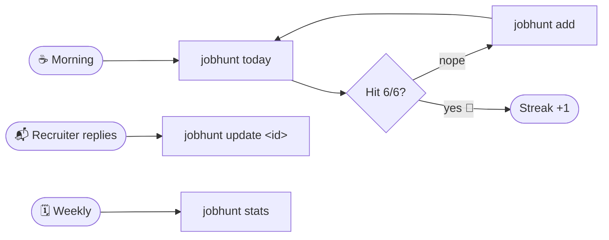

# 🎯 jobhunt

> A terminal-first job application tracker. Built because I got tired of forgetting which 30 companies I applied to last week.


```
$ jobhunt today

Today
  ████████████░░░░░░░░░░░░  3/6  (50%)

  3 more to hit today's target. Current streak: 4d.
```

---

## 🧠 Why this exists

I'm hunting for Junior/Mid **DevOps · Cloud · SRE** roles with a 6-applications-per-day target. Without a tracker:

- I lose count partway through the day → never sure if I hit the goal.
- Recruiters email back two weeks later and I have no clue which role they mean.
- A missed day quietly breaks momentum and I don't notice until the streak dies.

Spreadsheets are too far away. Notion takes four seconds to open. My terminal is already in front of me all day — so the tracker lives there too. `jobhunt add` is two seconds, zero context switch.

---

## 🔁 The daily workflow



A typical morning looks like this:

```
$ jobhunt today

Today
  ░░░░░░░░░░░░░░░░░░░░░░░░  0/6  (0%)

  6 more to hit today's target. Current streak: 4d.


$ jobhunt add
? Company: Cloudflare
? Role: Junior SRE
? Job posting URL (optional): https://cloudflare.com/careers/123
? Source: (Use arrow keys)
❯ LinkedIn
  Company site
  Referral
  Wellfound
  Indeed
  Hacker News
  Other
? Status: applied
? Notes (optional): Found via Hacker News Who's Hiring

✓ Logged: Junior SRE @ Cloudflare
  ID: ax8k2lm9
```

End of day:

```
$ jobhunt today

Today
  ████████████████████████  6/6  (100%)

✓ Target hit. Keep the streak going tomorrow.


$ jobhunt streak

Streak
  🔥 Current: 5 days
  🏆 Longest: 7 days
  📅 Active days: 14
```

---

## 📦 Install

```bash
git clone https://github.com/wasimat404/job-hunt.git
cd job-hunt
npm install
npm run build
npm link        # puts `jobhunt` on your PATH
```

Requires **Node 18+**. Tested on WSL2 (Ubuntu 24.04) and macOS.

---

## 🛠 Commands

| Command | What it does |
|---|---|
| `jobhunt add` | Log a new application (interactive prompt) |
| `jobhunt list` | Recent applications in a table |
| `jobhunt list --status interview` | Filter by status |
| `jobhunt list --limit 50` | Limit number of rows |
| `jobhunt today` | Today's progress vs your daily target |
| `jobhunt streak` | Current streak, longest streak, active days |
| `jobhunt update <id>` | Change status or notes for an existing entry |
| `jobhunt stats` | Totals, response rate, status breakdown |

**Status values:** `applied` · `screening` · `interview` · `offer` · `rejected` · `ghosted`

### Example: listing and updating

```
$ jobhunt list

┌──────────┬────────────┬──────────────┬────────────────────┬────────────┬──────────────┐
│ ID       │ Date       │ Company      │ Role               │ Status     │ Source       │
├──────────┼────────────┼──────────────┼────────────────────┼────────────┼──────────────┤
│ ax8k2lm9 │ 5/22/2026  │ Cloudflare   │ Junior SRE         │ applied    │ LinkedIn     │
│ b3pq7n2j │ 5/22/2026  │ Datadog      │ DevOps Engineer    │ applied    │ Company site │
│ c9r4t8wm │ 5/21/2026  │ Vercel       │ Platform Engineer  │ screening  │ Referral     │
│ d1k5v6yx │ 5/20/2026  │ Render       │ Site Reliability   │ interview  │ Hacker News  │
└──────────┴────────────┴──────────────┴────────────────────┴────────────┴──────────────┘
Showing 4 of 32 total


$ jobhunt update c9r4t8wm
Current: Platform Engineer @ Vercel [screening]
? New status: interview
? Notes (leave blank to keep current): Coding round Thursday 3pm

✓ Updated c9r4t8wm → interview


$ jobhunt stats

Stats
  Total applications: 32
  Response rate: 18.8%

Breakdown:
  applied     26 (81%)
  screening    3 ( 9%)
  interview    2 ( 6%)
  offer        1 ( 3%)
```

---

## 🏗 File structure

```
job-hunt/
├── README.md               ← you are here
├── package.json            ← deps, scripts, `bin` exposes `jobhunt`
├── tsconfig.json           ← strict TypeScript config
├── vitest.config.ts        ← test runner config
├── .gitignore
│
├── src/
│   ├── index.ts            ← CLI entry, wires up commands via commander
│   │
│   ├── commands/           ← one file per subcommand (single responsibility)
│   │   ├── add.ts          ← inquirer prompts → write new application
│   │   ├── list.ts         ← filter + sort + render as cli-table3
│   │   ├── today.ts        ← progress bar against daily target
│   │   ├── streak.ts       ← current + longest streak + active days
│   │   ├── update.ts       ← change status / notes for an existing entry
│   │   └── stats.ts        ← aggregate counts + response rate
│   │
│   └── lib/                ← reusable logic, no I/O coupling
│       ├── storage.ts      ← atomic JSON read/write to ~/.jobtracker/data.json
│       ├── streak.ts       ← pure streak calculation (tested)
│       └── types.ts        ← shared TypeScript interfaces
│
└── tests/
    └── streak.test.ts      ← 7 vitest cases covering streak edge cases
```

**Why this shape?** Commands are thin — they parse args, call into `lib/`, render output. The interesting logic lives in `lib/` where it's easy to test in isolation. No business logic in the CLI layer.

---

## 🔍 How it works

### Streak calculation — `src/lib/streak.ts`

A day "counts" toward a streak if **at least one** application was logged that day. The trickiest case: what if it's 9am and I haven't logged anything *yet today*? Should that break the streak?

**No** — the day isn't over. So the algorithm:

1. If something's logged today, start the walk from today.
2. If nothing's logged today, start from yesterday (give today a grace period).
3. Walk backward one day at a time. Stop on the first day with zero applications.

```ts
let cursor = todayCount > 0 ? today : subtractDays(today, 1);
while (byDay.has(dateKey(cursor))) {
  current += 1;
  cursor = subtractDays(cursor, 1);
}
```

The longest streak is found by sorting all active days and counting the longest run of consecutive ones. Pure function, deterministic, easy to test.

### Atomic writes — `src/lib/storage.ts`

If the process gets killed mid-write, a half-written JSON file would corrupt all data. So `saveData` writes to a temp file first and then renames:

```ts
const tmp = `${DATA_FILE}.tmp`;
await fs.writeFile(tmp, JSON.stringify(data, null, 2), 'utf-8');
await fs.rename(tmp, DATA_FILE);   // rename is atomic on POSIX
```

If the process dies before the rename, the original file is untouched. After the rename, the new file replaces the old one atomically.

### Where data lives

```
~/.jobtracker/data.json
```

A plain JSON file in your home directory. No database, no cloud, no telemetry, no account. You can `cat` it, back it up, version-control it, sync it across machines — it's just text.

---

## ✅ Tests

```bash
npm test
```

```
 ✓ tests/streak.test.ts (7)
   ✓ calculateStreak (7)
     ✓ returns zeros for empty input
     ✓ counts multiple applications on the same day
     ✓ detects a 3-day current streak ending today
     ✓ keeps the streak alive when nothing logged today yet
     ✓ breaks the current streak when yesterday was skipped
     ✓ returns 0 current when the most recent app is older than yesterday
     ✓ finds the longest streak correctly when there are multiple runs

 Test Files  1 passed (1)
      Tests  7 passed (7)
```

The streak logic is the most non-trivial piece and gets the most coverage — empty input, same-day duplicates, the grace-period edge case, broken streaks, multiple disconnected runs.

---

## 📚 Stack

- **TypeScript** (strict mode) — catches half my bugs before they ship
- **[commander](https://github.com/tj/commander.js)** — arg parsing, subcommands, help text
- **[inquirer](https://github.com/SBoudrias/Inquirer.js)** — interactive prompts
- **[chalk](https://github.com/chalk/chalk)** + **[cli-table3](https://github.com/cli-table/cli-table3)** — pretty terminal output
- **[nanoid](https://github.com/ai/nanoid)** — short, URL-safe IDs
- **[vitest](https://vitest.dev/)** — fast test runner with native ESM + TS

No frameworks, no boilerplate. Every dependency earns its place.

---

## 🗺 Roadmap

- [ ] `jobhunt export --csv` — dump for spreadsheets
- [ ] `jobhunt remind` — desktop notification if no apps logged by 6pm
- [ ] Auto-detect company/role from a pasted LinkedIn URL
- [ ] Optional sync via a private Gist
- [ ] Weekly digest: top sources, fastest responders

---
 — built by **[Wasim](https://wasims.vercel.app)** to scratch a real itch.

If you're job hunting too and this helps, that makes two of us. 🤝
